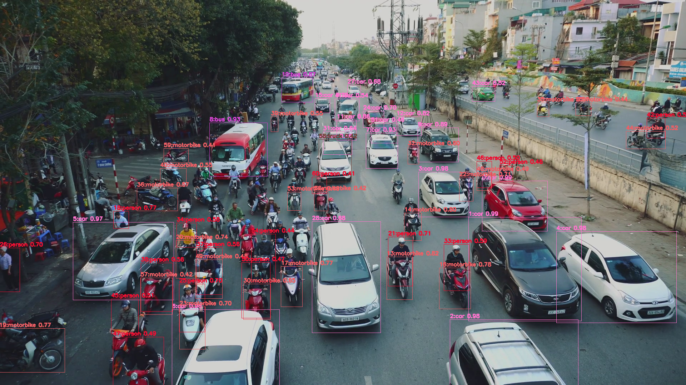

<h1> YOLOv4ObjectDetector</h1>
YOLOv4ObjectDetector is simple Python class to detect objects in an image by using
<a href="https://github.com/AlexeyAB/darknet">darknet YOLOv4</a>. 
 
 We have added the following new Python classes to the darknet. 
- <a href="./YOLOv4ObjectDetector.py">YOLOv4ObjectDetector</a> 
- <a href="./DetectedObjectDrawer.py">DetectedObjectDrawer</a> 
- <a href="./DetectConfigParser.py">DetectConfigParser</a> 
- <a href="./FiltersParser.py">FiltersParser</a> 

<h2>
1 Installation
</h2>
<h3>
1.1 Clone darknet
</h3>
Please clone darknet.git in a working folder from the following Web site. 

<a href="https://github.com/AlexeyAB/darknet">darknet YOLOv4</a>. 
 
<h3>
1.2 Clone YOLOv4ObjectDetector
</h3>
Please clone YOLOv4ObjectDetector.git in a folder from the following Web site. 

<a href="https://github.com/atlan-antillia/YOLOv4ObjectDetector">YOLOv4ObjectDetector</a>. 
 

<h3>
1.3 Download weight file(yolov4.weights)
</h3>
Please download weight file(yolov4.weights) from <a href="https://github.com/AlexeyAB/darknet/releases/download/darknet_yolo_v3_optimal/yolov4.weights">here</a>
or <a href="https://drive.google.com/open?id=1cewMfusmPjYWbrnuJRuKhPMwRe_b9PaT">Google drive </a>, and copy it to
 ./dataset/coco/weights/ folder in YOLOv4ObjectDetector.
 

<h3>
1.3 Deploy YOLOv4ObjectDetector to darknet
</h3>
Please copy files and folders in YOLOv4ObjectDetector to darknet or darknet/build/darknet/build/x64 (Windows10)

<h2>
2 Run YOLOv4ObjectDetector
</h2>

In darknet folder or or darknet/build/darknet/build/x64, run the following command. 

>python YOLOv4ObjectDetector.py image_file_dir coco_detect.config [filters] 
,where filters is an optional parameter,and specify a list of classe to be selected something like [car,person]

 

 
coco_detect.config 
<pre>
;coco_detect.config
[model]
dataset = coco
#weights = ./dataset/coco/weights/yolov4-tiny.weights
#config  = ./dataset/coco/yolov4-tiny.cfg

weights = ./dataset/coco/weights/yolov4.weights
config  = ./dataset/coco/cfg/yolov4.cfg
data    = ./dataset/coco/data/coco.data

[detection]
outputs   = ./dataset/coco/outputs
threshold=0.4
save_labels= True
</pre>

The above command will generate detected image, objects_detail.cv, and objects_stats.csv files
in the detecton/outputs folder specfied in coco_detec.config file.
 
 
Example 1: 

>python YOLOv4ObjectDetector.py images/img.png coco_detect.config

 

<b>
img.png.objects.csv
</b>
<pre>
id, class, score, x, y, w, h
0, car, 0.99, 1349, 507, 183, 141
1, car, 0.99, 1311, 609, 316, 291
2, car, 0.98, 1259, 896, 359, 188
3, car, 0.98, 1171, 482, 141, 126
4, car, 0.98, 1557, 649, 336, 256
5, car, 0.97, 204, 623, 282, 218
6, car, 0.96, 481, 868, 301, 214
7, car, 0.93, 1024, 373, 89, 99
8, bus, 0.93, 586, 344, 162, 150
9, car, 0.89, 1169, 358, 114, 96
10, bus, 0.87, 788, 218, 87, 68
11, car, 0.86, 942, 336, 55, 57
12, car, 0.82, 1109, 327, 70, 53
13, motorbike, 0.82, 1082, 720, 72, 120
14, motorbike, 0.80, 1131, 597, 48, 77
15, car, 0.79, 881, 276, 42, 40
16, motorbike, 0.78, 1229, 751, 88, 115
17, motorbike, 0.77, 786, 747, 60, 113
18, person, 0.77, 317, 592, 43, 49
19, motorbike, 0.77, -3, 921, 184, 123
20, motorbike, 0.74, 492, 674, 65, 106
21, person, 0.71, 1086, 664, 69, 138
22, motorbike, 0.71, 1285, 498, 39, 66
23, motorbike, 0.70, 502, 860, 72, 119
24, car, 0.70, 1016, 311, 58, 46
25, person, 0.70, 501, 796, 72, 135
26, person, 0.70, -1, 695, 56, 123
27, car, 0.68, 972, 238, 37, 32
28, car, 0.68, 873, 621, 192, 312
29, car, 0.66, 892, 391, 91, 119
30, motorbike, 0.65, 681, 796, 76, 100
31, car, 0.64, 904, 369, 81, 64
32, motorbike, 0.60, 1141, 411, 31, 49
33, person, 0.59, 1242, 685, 71, 130
34, person, 0.58, 494, 625, 56, 68
35, motorbike, 0.57, 1503, 288, 33, 39
36, motorbike, 0.57, 383, 527, 114, 64
37, person, 0.56, 550, 694, 72, 132
38, person, 0.56, 394, 737, 89, 136
39, motorbike, 0.55, 758, 327, 20, 42
40, motorbike, 0.55, 448, 472, 73, 46
41, car, 0.54, 937, 277, 68, 62
42, person, 0.52, 1810, 331, 51, 56
43, car, 0.52, 1321, 242, 64, 42
44, motorbike, 0.52, 1752, 368, 110, 49
45, person, 0.51, 311, 838, 76, 98
46, person, 0.50, 1334, 452, 42, 74
47, person, 0.49, 316, 945, 142, 135
48, motorbike, 0.49, 1334, 483, 41, 51
49, motorbike, 0.48, 547, 728, 75, 109
50, person, 0.47, 676, 736, 80, 156
51, car, 0.46, 1038, 345, 75, 56
52, person, 0.46, 1398, 463, 37, 45
53, motorbike, 0.46, 804, 538, 38, 52
54, person, 0.44, 703, 656, 68, 134
55, motorbike, 0.44, 1611, 288, 43, 36
56, motorbike, 0.42, 879, 537, 39, 54
57, motorbike, 0.42, 393, 779, 89, 103
58, truck, 0.42, 892, 391, 91, 119
59, motorbike, 0.41, 458, 416, 69, 40
60, person, 0.41, 873, 496, 41, 47

</pre>

 
<b>
img.png_stats.csv
</b>

<pre>
id, class, count
1,car,20
2,bus,2
3,motorbike,22
4,person,16
5,truck,1

</pre>
